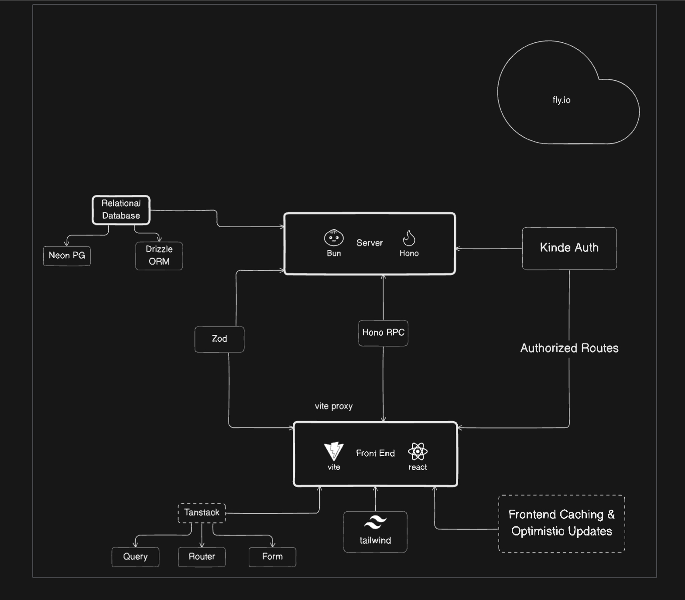
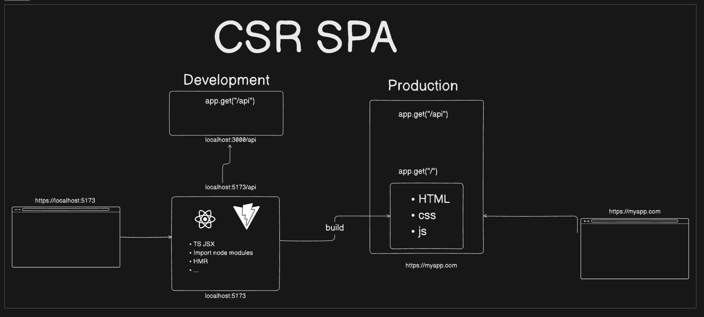

# expense-tracker

This is a simple expense tracker with backend server running on Bun runtime environment and Hono Framework, On the frontend part i've used React and Vite, tailwind and shadcn to style it.
Zod used for validation at runtime.
...will update further parts


CLient Side Rendered Single Page Application



To install dependencies:

```bash
bun install
```

To run:

```bash
bun run index.ts
```

This project was created using `bun init` in bun v1.1.21. [Bun](https://bun.sh) is a fast all-in-one JavaScript runtime.


